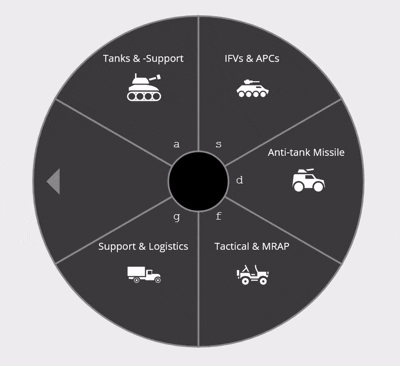

# UnraWheel.js

A lighweight wheel select element with zero dependencies, implemented as a vanilla js [Custom Element/Web Component](https://developer.mozilla.org/en-US/docs/Web/API/Web_components). Inspired by the Buy menu in CS:GO, UnraWheel allows the user to make a sequence of selections quickly by either clicking the sections, using the displayed keyboard shortcuts (which can be customized), or by using the tab key.

## Requirements

The element is provided as-is with no build dependencies or otherwise. Optional type definitions are provided as [JSDoc](https://jsdoc.app/) comments.

## Usage

Since the element isn't currently very composable I haven't made it into a package. Hence, you must use the old _yoink & twist_ method: copy the file `unrawheel.js` and paste it into your project. Feel free to modify it to make it fit your project's visual style (check the `style` and `#CSS` -properties).

Checkout the `/example` -folder for a working demo. You can clone this repository and run `npx live-server .` in the root to serve the files and test it out.

I recommend using a pre-defined amount of sections as shown in the demo for now. There are some visual bugs with changing the amount of sections on the fly. If you have 4-11 options per sequence, just set the `section-count` to 11 and the rest will appear blank and unselectable when there aren't enough options. If you must use `dynamic-section-count`, it works best if you allow the wheel to be locked for some time before calling `setSections` after user input so the "selection animation" has time to play.
